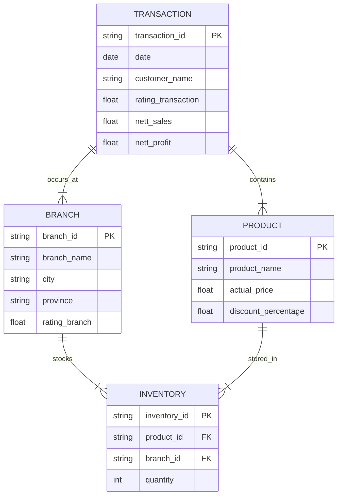

# Kimia Farma Big Data Analytics Project

## Background
Kimia Farma is one of the largest pharmaceutical companies in Indonesia. As a Big Data Analytics Intern, I was tasked with evaluating business performance from 2020 to 2023 through comprehensive data analysis. This project involves working with transaction data, inventory management, branch operations, and product information to derive meaningful insights that can drive business decisions.

## Objectives
1. Create an integrated data pipeline in BigQuery
2. Develop comprehensive analysis tables combining multiple data sources
3. Calculate key business metrics including profit margins and sales performance
4. Visualize insights through an interactive dashboard
5. Provide actionable recommendations based on data analysis

## Dataset Overview
The project utilizes four primary datasets:
1. `kf_final_transaction.csv` - Contains transaction records
2. `kf_inventory.csv` - Inventory management data
3. `kf_kantor_cabang.csv` - Branch office information
4. `kf_product.csv` - Product catalog and details

## Entity Relationship Diagram (ERD)


## SQL Implementation

### 1. Creating Analysis Table

```sql
-- Create the main analysis table
CREATE OR REPLACE TABLE `final_kimia_farma.kf_analysis` AS
WITH profit_calculation AS (
  SELECT 
    t.*,
    p.product_name,
    p.actual_price,
    p.discount_percentage,
    b.branch_name,
    b.kota,
    b.provinsi,
    b.rating_cabang,
    CASE
      WHEN p.actual_price <= 50000 THEN 0.10
      WHEN p.actual_price <= 100000 THEN 0.15
      WHEN p.actual_price <= 300000 THEN 0.20
      WHEN p.actual_price <= 500000 THEN 0.25
      ELSE 0.30
    END as persentase_gross_laba,
    p.actual_price * (1 - COALESCE(p.discount_percentage, 0)/100) as nett_sales
  FROM `final_kimia_farma.kf_final_transaction` t
  LEFT JOIN `final_kimia_farma.kf_product` p ON t.product_id = p.product_id
  LEFT JOIN `final_kimia_farma.kf_kantor_cabang` b ON t.branch_id = b.branch_id
)
SELECT 
  transaction_id,
  date,
  branch_id,
  branch_name,
  kota,
  provinsi,
  rating_cabang,
  customer_name,
  product_id,
  product_name,
  actual_price,
  discount_percentage,
  persentase_gross_laba,
  nett_sales,
  ROUND(nett_sales * persentase_gross_laba, 2) as nett_profit,
  rating_transaksi
FROM profit_calculation;
```

### 2. Additional Analysis Queries

```sql
-- Monthly Sales Analysis
CREATE OR REPLACE TABLE `final_kimia_farma.monthly_sales` AS
SELECT 
  FORMAT_DATE('%Y-%m', date) as month,
  COUNT(DISTINCT transaction_id) as total_transactions,
  COUNT(DISTINCT customer_name) as unique_customers,
  SUM(nett_sales) as total_sales,
  SUM(nett_profit) as total_profit,
  AVG(rating_transaksi) as avg_transaction_rating
FROM `final_kimia_farma.kf_analysis`
GROUP BY 1
ORDER BY 1;

-- Branch Performance Analysis
CREATE OR REPLACE TABLE `final_kimia_farma.branch_performance` AS
SELECT 
  branch_id,
  branch_name,
  kota,
  provinsi,
  COUNT(DISTINCT transaction_id) as total_transactions,
  SUM(nett_sales) as total_sales,
  SUM(nett_profit) as total_profit,
  AVG(rating_transaksi) as avg_transaction_rating,
  rating_cabang
FROM `final_kimia_farma.kf_analysis`
GROUP BY 1, 2, 3, 4, 9
ORDER BY total_sales DESC;
```

## Dashboard and Key Findings
The interactive dashboard for this analysis can be accessed at [Kimia Farma Analytics Dashboard](https://lookerstudio.google.com/reporting/9c3fdd0b-9109-4007-a3c7-ff0e029a6ee4). 


### Overall Performance
- Total Profit: Rp 98.5M
- Total Sales: Rp 347.0M
- Total Transactions: 672.5K

### Geographic Analysis
1. Top Performing Provinces:
   - Jawa Barat (Leading with Rp 29.1M profit)
   - Sumatera Utara (Rp 7M)
   - Jawa Tengah (Rp 6.8M)
   - Jawa Timur (Rp 5.1M)
   - Sulawesi Utara (Rp 4.9M)

2. Top 5 Performing Cities:
   - Subang
   - Garut
   - Purwakarta
   - Semarang
   - Ciamis

### Yearly Performance
- Consistent profit trends from 2020-2023
- Annual profit ranging between Rp 24.5M - 24.8M

### Branch Types Performance
Three categories with distinct performance patterns:
- Kimia Farma - Apotek
- Kimia Farma - Klinik & Apotek
- Kimia Farma - Klinik-Apotek-Laboratorium

## Recommendations

### 1. Regional Optimization
- Focus on expanding successful business models from top-performing cities (Subang, Garut, Purwakarta)
- Implement regional distribution centers in West Java to support high-performing areas
- Develop city-specific marketing strategies based on local performance data

### 2. Operational Improvements
- Standardize best practices from high-performing branches
- Optimize inventory management based on city-specific demand patterns
- Implement customer feedback systems across all locations

### 3. Business Development
- Consider converting single-service locations to multi-service centers in strategic locations
- Develop loyalty programs in high-transaction areas
- Create targeted promotional strategies based on local market analysis

## Technical Requirements
- Google Cloud Platform account
- BigQuery access
- Access to Looker Studio (formerly Google Data Studio)

## Future Improvements
1. Implement real-time data updates
2. Add predictive analytics components
3. Enhance customer segmentation analysis
4. Develop automated reporting system
